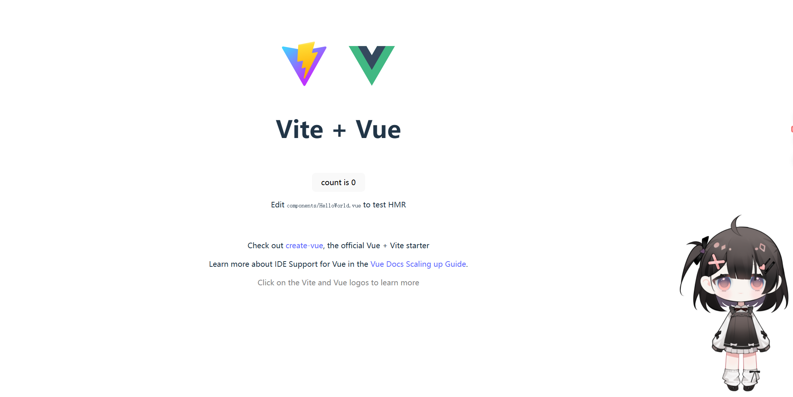

# live2dEasyControl

更简单更随心所欲地在web中使用Live2D模型

参考代码**[CubismWebSamples](https://github.com/Live2D/CubismWebSamples)**

## 拉取

创建vite项目后拉取，通过npm初始化。

在[下载Live2D Cubism SDK for Web | Live2D Cubism](https://www.live2d.com/zh-CHS/sdk/download/web/)上下载SDK，将文件Framework和core文件放入项目目录。

将live2d模型文件放入public下，可以参考`default.json`文件内路径设置，当前项目测试模型来源于b站up主**屋呜屋呜**[【Live2D免费模型展示】再也不会觉得寂寞_哔哩哔哩_bilibili](https://www.bilibili.com/video/BV14CWyeREW1/?spm_id_from=333.1387.homepage.video_card.click)，使用需自行下载，本项目不提供。

`npm run dev`运行

## 使用

以在vue项目使用为例

通过`npm i live2d-easy-control`安装工具包

`mian`内导入使用

```TypeScript 
import { createApp } from 'vue'
import './style.css'
import App from './App.vue'
import { load } from 'live2d-easy-control' 

load({
    "modelDir": "",  // 模型文件名
    "resourcesPath": "/Resources/"
})

createApp(App).mount('#app')
```

更多配置信息可以参考`main/src/config/define.ts`

可以自行配置json文件后使用`load`加载，参考配置文件`example.json`



## 功能

1. `load` 加载，可以直接传入对象或是json配置文件目录

2. `setPointMovedEvent` 设置模型跟随鼠标晃动，仅在画布内生效（后续会优化）`removePointMovedEvent` 移除跟随移动事件

3. `setPointClickEvent` 设置模型点击随机切换表情或动作，可以在配置文件中设置点击区域，`removePointClickEvent`移除点击事件

4. `getAllExpressionsInfo getDefine getMotion getExpression`获取模型配置文件信息，部分信息可以直接在模型文件夹中的`.model3.json`查看

5. `playMotion`播放动作，参数：组名`group`,编号`no`,优先级`priority`，具体内容见自己下载的模型文件夹中的`.model3.json`查看

6. `playExpression`播放表情，与动作类似，参数更简单，只需要表情名，`stopExpression`停止表情播放（存在过渡不自然问题）

   解决方案：设置默认表情替换原始状态，选定一个表情作为默认表情，当要结束某个表情时直接调用`stopExpression`进行切换。

   项目内演示案例`example.json`:

   ```json
   {
       "modelDir": "冷冷小人",
       "resourcesPath": "/Resources/",
       "expressionNames": {
           "default": "" // 默认表情名
           "" : ""// 其他”表情名“：“原名”
       },
       "motionNames": {
           "default": { "group": "", "no": -1 ,"priority": 0 } // 默认闲置动作
       }
   }
   ```

   > motion用的较少，很多live2d模型没有该功能，可以选择忽略。

   该文件可以对其他表情进行重命名，通过`getExpression` 来获取调用，避免直接修改`.model3.json`文件( ~~没什么用其实，直接改文件更方便~~)

7. `setAngle``setAngleXY``reSetAngle`设置live2d模型朝向，`setAngle`通过光标位置，`setAngleXY`通过XY坐标，`reSetAngle`恢复朝向。

8. `setMessage``hideMessageBox`设置对话框显示和隐藏，`setMessage`参数：`message`消息内容,`duration?`持续时间

9. `setLipSync`设置嘴巴大小，参数：`vlaue `大小 推荐值0.0-0.5,`weight`权重 默认0.8

10. `stop`关闭模型渲染